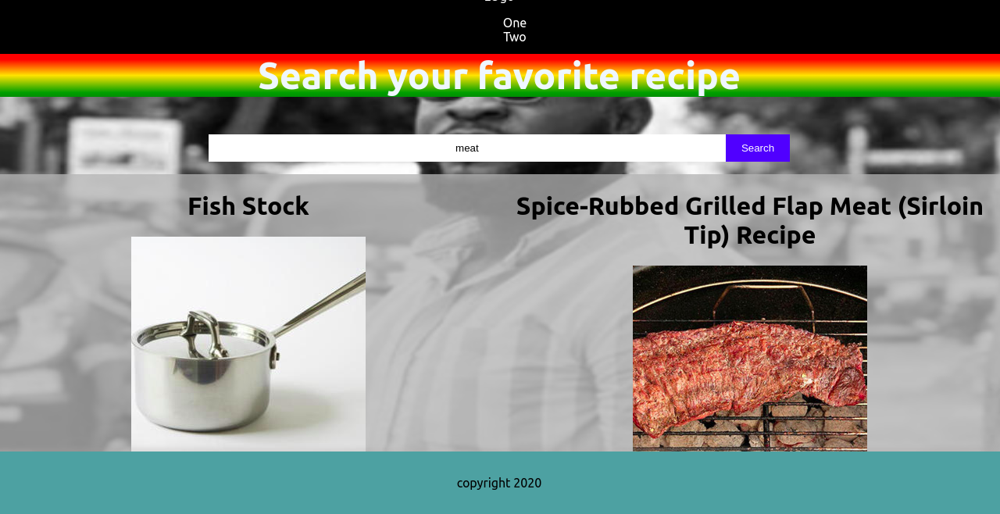
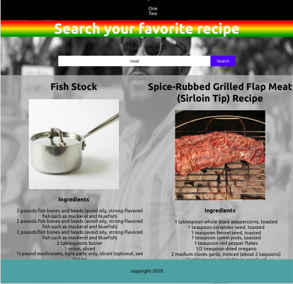
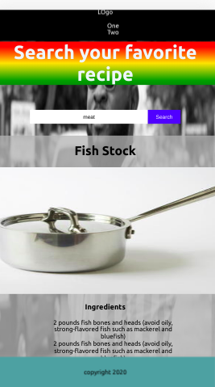

# A Simple Recipe App

> Building a Recipe App with the React and Edamam API

## Features

1. User can search a any recipe of their choice
2. User can use this app as a guide in their daily cooking lives

## Future Feature (v1.12)

1. Improve the UI

## Screenshots

### Desktop/Laptoop device

### Tables device

### Mobile device

## Built With

- React
- Javascript es6

## Live Demo

[Live Demo Link](https://blissful-babbage-dd9079.netlify.app/)

## Getting Started

To get a local copy up and running follow these simple example steps.

1. `git clone https://github.com/addod19/recipe.git`
2. `cd recipe`
3. `git checkout start`
4. `yarn i`
5. `yarn start`
6. Use live server on VSCode to open the index.html with your favorite browser

### Prerequisites

- A modern browser

### Deployment

- Signup for netlify app
- Authorize the app to use Github
- Configure the app for deployment

## Authors

👤 **Daniel Larbi Addo**

- Github: [@addod19](https://github.com/addod19)
- Twitter: [@DanielLarbiAdd1](https://twitter.com/DanielLarbiAdd1)
- Linkedin: [Daniel Larbi Addo](https://linkedin.com/in/daniel-larbi-addo/)
- Email: [Daniel Larbi Addo](addodaniellarbi@gmail.com)

## 🤝 Contributing

Contributions, issues and feature requests are welcome!

Feel free to check the [issues page](https://github.com/addod19/recipe/issues).

1. Fork it (https://github.com/addod19/recipe/fork)
2. Create your feature branch (git checkout -b my-new-feature)
3. Commit your changes (git commit -am 'Add some feature')
4. Push to the branch (git push origin my-new-feature)
5. Create a new Pull Request

## Show your support

Give us a ⭐️ if you like this project!

## Acknowledgments

- Hat tip to anyone whose code was used
- Inspiration
- etc

## 📝 License

This project is [Apache](lic.url) licensed.
